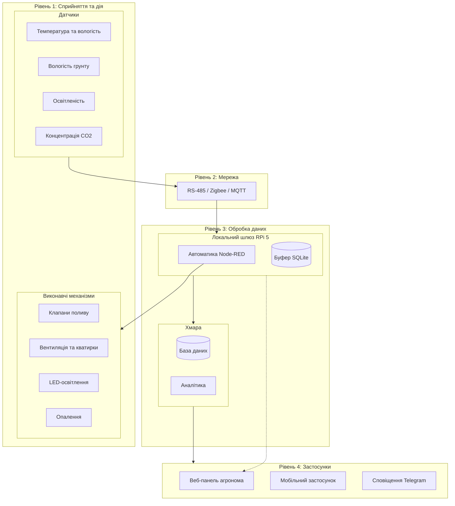

Открой редактирование файла на GitHub (значок карандаша), **выдели всё через `Cmd + A**`, нажми **Delete / Backspace** (чтобы файл стал абсолютно пустым) и вставь вот этот текст целиком:


# Проєкт IoT-системи: Розумна теплиця (200 м²)

## 1. Архітектурна діаграма системи




---

## 2. Таблиця складу системи

Теплиця площею 200 м² (розмір 10 × 20 м) розділена на 4 функціональні сектори для незалежного контролю мікроклімату.

| Пристрій / Компонент | Тип | Що вимірює або робить | Кількість | Де розміщено |
| --- | --- | --- | --- | --- |
| **SHT35** | Датчик | Температура (-40...+125 °C) та вологість повітря (0-100%) | 4 шт. | 1.5 м від ґрунту в центрі кожного сектора |
| **Capacitive Soil Moisture v2.0** | Датчик | Вологість ґрунту ємнісним методом | 8 шт. | Прикоренева зона рослин (по 2 на сектор) |
| **BH1750** | Датчик | Рівень освітленості (1–65535 Lux) | 2 шт. | Верхній ярус під покрівлею теплиці |
| **MH-Z19B** | Датчик | Концентрація вуглекислого газу CO2 (0–5000 ppm) | 2 шт. | Центральний прохід на висоті 1.5 м |
| **ESP32 Edge Node** | Мікроконтролер | Збір показів датчиків сектора, первинна фільтрація | 4 шт. | Герметичні бокси IP65 на опорних колонах |
| **Електромагнітні клапани 12V** | Актюатор | Подача води на лінії крапельного поливу | 4 шт. | Розподільчий гідровузол |
| **Сервоприводи кватирок** | Актюатор | Відкриття кватирок даху для провітрювання | 4 шт. | Верхній вентиляційний ярус |
| **Витяжні вентилятори** | Актюатор | Примусова витяжка повітря при перегріві | 2 шт. | Торцеві стіни теплиці під дахом |
| **LED-фітолінійки** | Актюатор | Штучне досвітлення рослин | 8 ліній | Підвішені над грядками |
| **Контур обігріву (SSR)** | Актюатор | Керування нагрівальними елементами 220V | 2 контури | По периметру теплиці вздовж стін |
| **Raspberry Pi 5** | Шлюз / Fog | Локальна автоматика, збереження правил і буфера | 1 шт. | Шафа автоматики IP66 у тамбурі |

---

## 3. Обґрунтування розміщення обробки: Edge, Fog чи Cloud

У системі застосовано гібридну модель Fog/Cloud.

**Вимоги до затримок:**

* Захист від перегріву та аварійна вентиляція: **менше 1–2 секунд** (критично для збереження врожаю в спекотні дні).
* Керування поливом та досвітленням: **до 10–30 секунд**.
* Аналітика та довгострокові звіти: **від хвилин до годин**.

**Розподіл функцій:**

* **Edge (ESP32):** Збір сигналів, антибрязкання, апаратний тайм-аут вимкнення реле у разі збою зв'язку.
* **Fog (Raspberry Pi 5):** Всі рішення щодо поливу, провітрювання та підігріву приймаються тут. Затримка до 100 мс, повна автономність від наявності інтернету.
* **Cloud:** Довготривалий архів, візуалізація через зовнішні веб-інтерфейси, важкі аналітичні розрахунки.

---

## 4. Сценарій на випадок втрати зв'язку з хмарою (Offline Fallback)

1. **Локальна робота автоматики:** Рушій правил Node-RED на Raspberry Pi виконує всі алгоритми локально за таймерами та показами датчиків. Втрата зв'язку з інтернетом ніяк не зупиняє полив чи вентиляцію.
2. **Буферизація телеметрії:** У разі відсутності зв'язку всі пакети накопичуються в локальній базі SQLite на Raspberry Pi (ємності вистачає на 30+ діб). Після появи зв'язку черга автоматично вивантажується в хмару.
3. **Локальний веб-інтерфейс:** Доступний резервний дашборд у локальній мережі теплиці через Wi-Fi шлюзу.

---

## 5. Оцінка добового обсягу телеметрії

* Кліматичні сенсори (T, RH, Lux, CO2): опитування 1 раз на 30 с = 11 520 повідомлень/добу.
* Вологість ґрунту (8 датчиків): опитування 1 раз на 5 хв = 2 304 повідомлень/добу.
* Статуси реле та heartbeat: ~1 500 повідомлень/добу.
* **Всього пакетів на добу:** ~15 324 шт.
* **Обсяг трафіку:** 15 324 пакети × 150 байт (з урахуванням заголовків TCP/TLS) ≈ **2.3 МБ/добу** (з урахуванням службового трафіку — до 5 МБ/добу).

---

## 6. Безпека

| № | Загроза | Вектор атаки | Захід протидії |
| --- | --- | --- | --- |
| **1** | **Підміна команд (MitM)** | Перехоплення незахищеного трафіку та безперервне відкриття клапанів поливу | Шифрування TLS 1.3, автентифікація mTLS; апаратний таймаут на ESP32 (клапан закривається сам через 20 хв). |
| **2** | **Підробка даних датчиків** | Введення фальшивих температурних показів для зупинки вентиляції | Фільтрація викидів, перевірка швидкості зміни показників ($dT/dt$) та взаємне порівняння між 4 секторами. |
| **3** | **Шкідлива прошивка (OTA)** | Заливка модифікованої прошивки на ESP32 для виведення з ладу | Перевірка цифрового підпису оновлення (Secure Boot), заблоковані порти JTAG/UART. |

```

```
