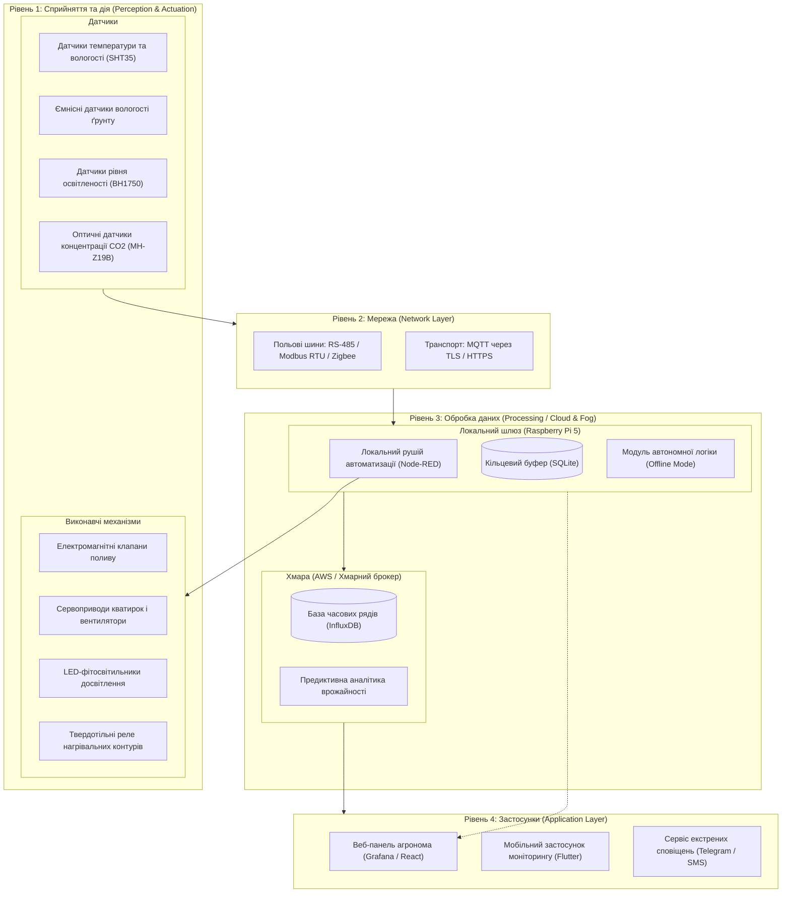

Ось один готовий блок тексту для файлу `README.md`.

У ньому вже є все: виправлена Mermaid-діаграма (без помилок рендерингу GitHub), повноцінні Markdown-таблиці складу системи, розрахунків та безпеки. Просто натисни кнопку **Copy** у правому верхньому кутку цього кодового блоку і встав у файл `README.md` на GitHub:

```markdown
# Проєкт IoT-системи: Розумна теплиця (200 м²)

## 1. Архітектурна діаграма системи (Mermaid)

Архітектура розроблена за 4-рівневою моделлю IoT з виділеним рівнем туманних обчислень (Fog Computing) для повної локальної автономності об'єкта.



---

## 2. Таблиця складу системи

Теплиця площею 200 м² (розмір 10 × 20 м) розділена на 4 функціональні сектори для незалежного та точного контролю параметрів мікроклімату.

| Пристрій / Компонент | Тип | Що вимірює або робить | Кількість | Де розміщено |
| --- | --- | --- | --- | --- |
| **SHT35 (у захисному боксі)** | Датчик | Вимірює температуру (-40...+125 °C) та відносну вологість повітря (0-100%) | 4 шт. | Підвішені в зоні росту рослин (1.5 м від ґрунту) в центрі кожного із 4 секторів |
| **Capacitive Soil Moisture v2.0** | Датчик | Вимірює об'ємний вміст вологи в ґрунті ємнісним методом | 8 шт. | Занурені в прикореневу зону рослин (по 2 одиниці на сектор) |
| **BH1750** | Датчик | Вимірює рівень природної освітленості (1–65535 Lux) | 2 шт. | Верхній ярус під покрівлею (у передній та задній частинах теплиці) |
| **MH-Z19B (NDIR)** | Датчик | Вимірює вміст діоксиду вуглецю в діапазоні 0–5000 ppm | 2 шт. | На висоті 1.5 м у центральному проході теплиці |
| **ESP32 Edge Node** | Мікроконтролер | Збирає показники сенсорів сектора, фільтрує шуми та передає дані по RS-485 | 4 шт. | Монтажні герметичні коробки зі ступенем захисту IP65 на опорних колонах |
| **Електромагнітні клапани (12V)** | Актюатор | Відкривають та перекривають подачу води в лінії крапельного зрошення | 4 шт. | На розподільчому вузлі поливу біля баків з водою |
| **Сервоприводи кватирок** | Актюатор | Відкривають віконні фрамуги даху для природного провітрювання | 4 шт. | На віконних рамах верхнього вентиляційного поясу |
| **Витяжні промислові вентилятори** | Актюатор | Забезпечують примусове охолодження та циркуляцію повітря | 2 шт. | У торцевих стінах теплиці під коником даху |
| **LED-фітопанелі повного спектра** | Актюатор | Забезпечують штучне досвітлення рослин за браку сонячного світла | 8 ліній | Підвішені над грядками з можливістю регулювання висоти |
| **Опалювальний контур (через SSR)** | Актюатор | Керує електронагрівачами або циркуляційним насосом теплоносія | 2 контури | Вздовж бічних стін по периметру конструкції теплиці |
| **Raspberry Pi 5 (Edge/Fog Gateway)** | Шлюз / Контролер | Виконує локальні алгоритми, обробляє сценарії, зберігає локальний буфер | 1 шт. | У щитку автоматики зі ступенем захисту IP66 у технічному тамбурі |

---

## 3. Обґрунтування розміщення обробки: Edge, Fog чи Cloud

У системі реалізовано **гібридну Fog/Cloud модель**, де функції оперативного захисту та підтримання клімату повністю делеговані на рівень **Fog/Edge**.

### Вимоги до затримок (Latency Requirements):

1. **Захист від перегріву та вентиляція:** допустима затримка **не більше 1–2 секунд**. У сонячний літній день температура в закритій теплиці площею 200 м² здатна критично піднятися за декілька хвилин. Будь-які затримки хмарного підключення можуть призвести до загибелі рослин через термічний шок.
2. **Контроль поливу й освітлення:** допустима затримка **до 10–30 секунд**.
3. **Глобальна статистика та аналітика:** допустима затримка **від кількох секунд до хвилин**.

### Розподіл завдань:

* **Edge (ESP32):** Первинне зчитування сигналів датчиків, відсікання шумів та апаратний таймаут (Watchdog) для негайного вимкнення реле у разі зависання.
* **Fog (Raspberry Pi 5):** Локальне прийняття рішень (запуск поливу за порогом вологості, увімкнення нагріву за графіком, регулювання відкриття вікон). Шлюз забезпечує відгук у межах 50–100 мс і працює безперебійно навіть без Інтернету.
* **Cloud (Хмара):** Довгострокове накопичення даних, предиктивна аналітика витрати ресурсів і надання віддаленого веб-інтерфейсу для користувача.

---

## 4. Сценарій на випадок втрати зв'язку з хмарою (Offline Fallback)

Система побудована за архітектурним принципом **«Local-First»**:

1. **Повна автономність регулювання:**
Шлюз Raspberry Pi зберігає локальну логіку у рушії Node-RED. Усі операції з керування нагрівачами, поливом, кватирками та освітленням виконуються за заздалегідь завантаженими правилами без потреби у зв'язку із зовнішніми серверами.
2. **Буферизація даних (Store-and-Forward):**
У разі зникнення сигналу мережі Інтернет телеметрія не губиться, а записується в локальну базу даних SQLite на внутрішньому накопичувачі шлюзу (розрахована на зберігання до 30 діб безперервної роботи). Після відновлення доступу до хмарного брокера черга повідомлень автоматично синхронізується з хмарою.
3. **Локальний пульт керування:**
У разі аварії персонал може під'єднатися смартфоном або ноутбуком безпосередньо до локальної Wi-Fi мережі теплиці та отримати доступ до локального веб-інтерфейсу на Raspberry Pi.

---

## 5. Оцінка добового обсягу телеметрії

### Таблиця періодичності збору та розрахунку пакетів:

| Тип параметра | Періодичність опитування | Кількість джерел | Формула розрахунку | Кількість повідомлень/добу |
| --- | --- | --- | --- | --- |
| **Клімат (T°, RH, CO2, Lux)** | 1 раз на 30 секунд (2/хв) | 4 сектори | $4 \times 2 \times 1440$ хв | 11 520 |
| **Вологість ґрунту** | 1 раз на 5 хв (12/год) | 8 сенсорів | $8 \times 12 \times 24$ год | 2 304 |
| **Статуси актюаторів + Heartbeat** | За подією + 1 раз на хвилину | Всі реле/клапани | Подієві логи + контрольні | ~1 500 |
| **РАЗОМ** | — | — | — | **≈ 15 324 повідомлень** |

### Розрахунок трафіку:

* Розмір одного корисного навантаження JSON (`payload`): ≈ 70 байт.
* Розмір пакета з урахуванням заголовків TCP/IP та шифрування TLS: ≈ 150 байт.
* **Добовий обсяг чистої телеметрії:**
$$15\,324 \times 150 \text{ байт} \approx 2\,298\,600 \text{ байт} \approx \mathbf{2.3 \text{ МБ/добу}}.$$


* З урахуванням службового трафіку TLS-сесій та keep-alive пакетів загальний трафік не перевищує **5 МБ на добу**, що гарантує стабільну роботу навіть через звичайний мобільний зв'язок (2G/LTE).

---

## 6. Розділ «Безпека»

| № | Загроза для системи | Вектор атаки та наслідки | Комплекс заходів протидії |
| --- | --- | --- | --- |
| **1** | **Перехоплення керування (Man-in-the-Middle)** | Несанкціоноване перехоплення незахищених команд у мережі та примусове відкриття клапанів поливу, що спричинить затоплення теплиці | Шифрування протоколу зв'язку за стандартом **TLS 1.3**, взаємна автентифікація за сертифікатами (**mTLS**) між шлюзом і сервером. Впровадження апаратного тайм-ауту на мікроконтролері: клапан поливу автоматично блокується через 20 хвилин роботи незалежно від наявності зовнішнього сигналу зупинки. |
| **2** | **Підробка показників датчиків (Sensor Spoofing)** | Подання неправдивих значень температури (наприклад, симуляція переохолодження), що призведе до постійного вмикання нагрівачів та критичного перегріву рослин | Програмна валідація даних на рівні Fog-шлюзу: відхилення аномальних стрибків градієнта ($dT/dt$), фільтрація шумів медіанним фільтром та крос-верифікація даних між сусідніми секторами теплиці. |
| **3** | **Шкідлива модифікація прошивки (Malicious OTA Update)** | Спроба завантажити шкідливе ПЗ на вузли ESP32 для виведення обладнання з ладу або включення пристроїв до ботнету | Обов'язкова перевірка цифрового підпису кожного оновлення (**Secure Boot та шифрування Flash** на чіпі ESP32), закриття доступу до сервісних портів UART/JTAG після прошивки, заборона оновлення без локального підтвердження. |

```

```
